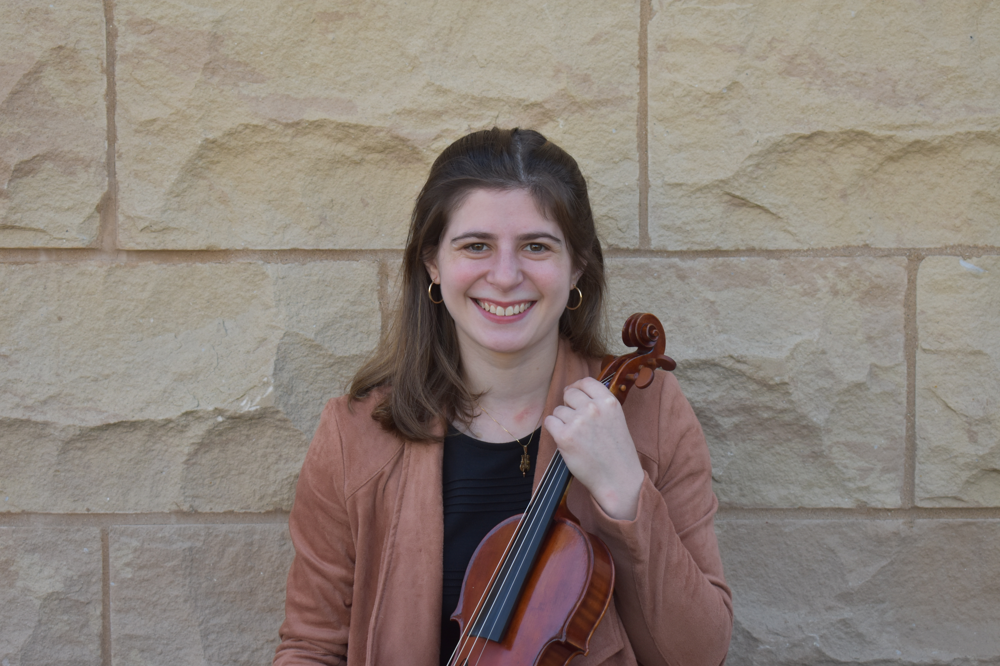
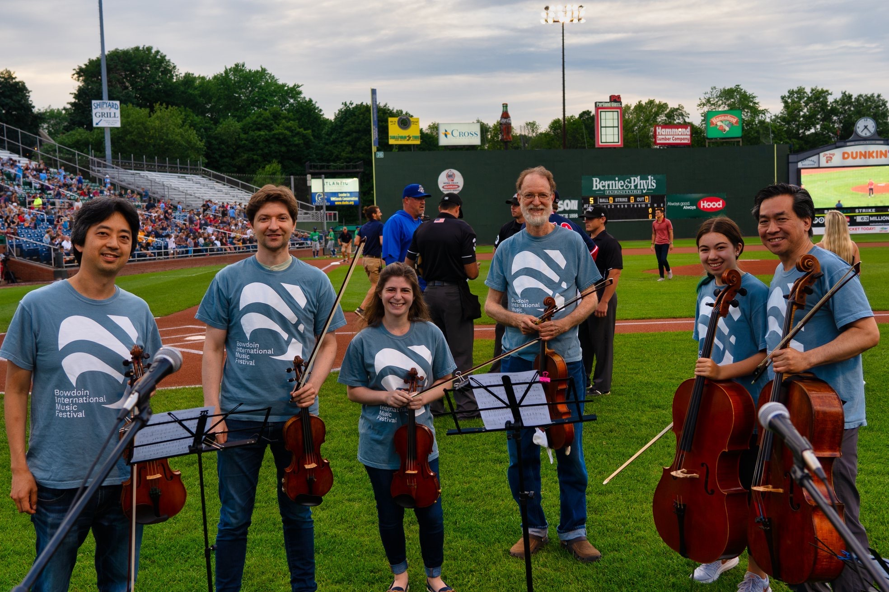

```{r figurename, echo=FALSE, out.width = '40%', fig.align="center"}

```

My goal as a teacher is to inspire each of my students to become their own teacher by developing as creative and thoughtful musicians. I believe that communicating with students in a kind and respectful manner is of the utmost importance to foster a love of learning and performing and to instill life-long practice skills. I urge my students to constantly be creative in their approach to practicing and music-making by offering a variety of ways to practice technical passages and encourage students to decide their own musical phrasing and characters within a piece. I also emphasize freedom and physical relaxation in playing and enjoy problem solving alongside students to ensure ease and comfort when playing.
I particularly look forward to studio lessons because they offer a unique experience of really understanding a student’s goals, personality, and learning style. I cultivate a meaningful relationship with each student ensuring that they feel safe, valued, and inspired. I take the time to set up personal meetings with my students before they begin their studies and discuss their learning objectives and musical interests. Together we collaborate on choosing repertoire that interests and excites them. As a result, I teach a wide variety of genres, composers from underrepresented backgrounds, and I am constantly learning new works alongside my students which I enjoy immensely. 
Beyond studio lessons, I am constantly creating and finding opportunities for my students to perform and explore multi-faceted careers as emerging artists. I encourage my students to explore performing opportunities in the community, as I believe that performing frequently is a critical part to musical advancement. Furthermore, I strongly believe that if you can convey the characters, emotions, and technique in an engaging performance to audiences not familiar with classical music, you have not only fully learned the piece, but you have made a meaningful contribution to the community and perhaps inspired others to share in your musical passion. My unique method of teaching encompasses a thoughtful and diligent approach to musical technique, a high standard of musical excellence, a commitment to community outreach and performance, public speaking preparation, and a collaborative experience that is student-centered and fosters a life-long appreciation and passion for music.

```{r figure2, echo=FALSE, out.width = '40%', fig.align="center"}

```

Currently, I teach at the University of Illinois Urbana-Champaign as a Violin Teaching Assistant. I have taught the following courses to Music Majors and Non-Music Majors at the Undergraduate and Graduate levels:<br>
MUSC 110- Violin <br>
MUSC 410- Advanced Violin <br>
MUSC 450- Chamber Music <br> 
Violin Scale Technique Class- Undergraduate and Graduate Violin Music Majors <br>

I am the Coordinator and a Violin Instructor at the Illinois Community Music Academy:<br>
Teach Studio Lessons: Middle School-Adult<br>
Coach Chamber Music<br>
Lead Youth Orchestra Sectionals<br>
Direct Curriculum Meetings for ICMA instructors<br>

https://music.illinois.edu/illinois-community-music-academy

Summer Teaching: I am a Chamber Music Coach and Faculty Member at the Easton Chamber Music Festival in Massachusetts:
http://eastonchambermusicfestival.org/index.html

I have lectured on String Quartet Pedagogy in Higher Education at the Paul Rolland String Pedagogy Workshop (2021) and the American String Teacher’s Association (ASTA) National Conference (2022). I received my Level 1 Rolland Certification in 2021.

I am also available for Public Speaking Workshops for Presenting Music in Community Settings. Past masterclasses have been given at the University of Illinois Urbana-Champaign and for the Peabody String Sinfonia in Baltimore, MD.

Past Teaching: Violin Teaching Assistant to Violaine Melancon at McGill University (Undergraduate Etude Lessons), Guest Violin Workshop for Aphasia Group of Middle Tennessee, Vanderbilt University Medical Center (2020), and Studio Teaching in Baltimore, MD (2015-2018)

